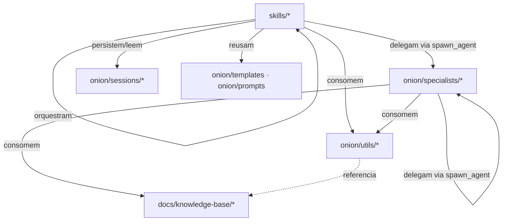

# Meta-spec — Arquitetura do Sistema Onion (nativo Zed)

## Propósito

Define a estrutura de diretórios obrigatória, o princípio de **framework instalável** e as dependências permitidas entre categorias. No port nativo Zed ([ADR 0001](./adr/0001-zed-native-port.md)), o esqueleto passa de `.claude/` para `.agents/` + `.zed/` + `AGENTS.md`. Esta spec normatiza o que constitui o "esqueleto" do Sistema Onion como artefato reutilizável em projetos-alvo.

Aplica-se ao **Sistema Onion**, não ao projeto-alvo onde o Onion é instalado.

Referências relacionadas:

- [agents.md](./agents.md), [commands.md](./commands.md)
- [code-standards.md](./code-standards.md), [integrations.md](./integrations.md)
- [adr/0001-zed-native-port.md](./adr/0001-zed-native-port.md) — régua do port

---

## 1. Estrutura de diretórios obrigatória

### 1.1 Root do framework

```
.agents/                    # Operacional — skills + specialists + recursos (nativo Zed)
.zed/                       # Configuração Zed (settings.json: tool_permissions, context_servers)
docs/                       # Documentação consumida por humanos e IA
AGENTS.md                   # Rules nativas do Zed (substitui CLAUDE.md)
README.md                   # Identidade e ponto de entrada
CONTRIBUTING.md             # Guidelines para evolução
.env, .env.example          # Configuração de providers e integrações
```

> **Mudou do legado:** `.claude/` → `.agents/`; `CLAUDE.md` → `AGENTS.md`; `.claude/settings.json` (permissions/hooks) → `.zed/settings.json` (`agent.tool_permissions`); `.mcp.json` → `.zed/settings.json` (`context_servers`).

### 1.2 Estrutura de `.agents/`

```
.agents/
├── skills/                          # Catálogo FLAT de skills (filhas diretas)
│   ├── onion/                       # Orquestrador master (cérebro)
│   ├── onion-warmup/
│   ├── onion-patterns/
│   ├── onion-validation/
│   ├── language-standards/
│   └── onion-<categoria>-<comando>/ # ex-comandos, 1 pasta por skill
│       └── SKILL.md
│
└── onion/                           # Recursos do framework
    ├── specialists/                 # Personas delegáveis via spawn_agent
    │   └── <slug>.md
    ├── utils/                       # Abstrações
    │   └── task-manager/            # Task Manager Abstraction (factory, interface, types, detector, adapters/)
    ├── templates/                   # Fragmentos de template reutilizáveis
    ├── prompts/                     # Fragmentos de prompt compartilhados
    └── sessions/                    # Estado persistente de workflows faseados
        └── <feature-slug>/          # context.md, architecture.md, plan.md, notes.md
```

> **Regra dura:** skills são filhas **diretas** de `.agents/skills/`. Pastas aninhadas **não são descobertas** pelo Zed — a categoria vai no nome (`onion-git-feature-start`), não em subpasta.

### 1.3 Estrutura de `.zed/`

```
.zed/
└── settings.json    # agent.default_model, agent.subagent_model,
                     # agent.tool_permissions (default/always_allow/always_confirm/always_deny),
                     # context_servers (MCP do provider ativo)
```

### 1.4 Estrutura de `docs/`

```
docs/
├── INDEX.md
│
├── meta-specs/             # L0 — constituição do framework (esta spec é uma delas)
│   ├── index.md
│   ├── agents.md
│   ├── commands.md
│   ├── architecture.md
│   ├── code-standards.md
│   ├── integrations.md
│   └── adr/
│       └── 0001-zed-native-port.md
│
├── analysis/               # Análises críticas datadas (snapshots; inclui zed-port-spike)
├── plans/                  # Planos de execução
├── knowledge-base/         # KBs estruturadas para consumo por IA
│   ├── concepts/  frameworks/  tools/  platforms/  providers/
│
├── business-context/       # Template vazio — populado no projeto-alvo
├── technical-context/      # Template vazio — populado no projeto-alvo
└── compliance-context/     # Template vazio — populado no projeto-alvo (quando aplicável)
```

---

## 2. Separação de responsabilidades

Três camadas operacionais distintas:

| Camada | Local | Natureza | Como é invocada |
|---|---|---|---|
| **Skills** | `.agents/skills/<nome>/SKILL.md` | Operacional — fluxos invocáveis | `/onion-<cat>-<cmd>` ou `@skill` |
| **Specialists** | `.agents/onion/specialists/<slug>.md` | Personas de delegação | `spawn_agent` + caminho da persona |
| **Docs** | `docs/**` | Documentação / explicação / análise | Leitura direta (humano + IA) |

| Aspecto | `.agents/` | `docs/` |
|---|---|---|
| Natureza | Operacional | Documentação |
| Consumido por | Zed (em runtime) | Humanos + IA (em leitura) |
| Acesso pelo usuário | Indireto via `/skill`, `@skill`, `spawn_agent` | Direto via leitura de arquivos |

**Regra**: artefato invocável vive em `.agents/`; descrição/explicação/análise vive em `docs/`; configuração vive em `.zed/settings.json` e `.env`.

---

## 3. Princípio de framework instalável

O Sistema Onion deve ser **instalável em qualquer projeto** (novo, legado ou regulado) **copiando ou clonando `.agents/`, `.zed/`, `AGENTS.md` e (opcionalmente) `docs/`** sem necessidade de adaptação de paths absolutos.

### 3.1 Premissas que o framework PODE assumir

- Projeto aberto no **Zed** (com worktree confiável para descobrir skills locais e `context_servers`)
- `AGENTS.md` no root, lido nativamente como rules
- `.zed/settings.json` no projeto (pode ser estendido)
- Pode ter `.env` no root (criado a partir de `.env.example` via `/onion-meta-setup-integration`)
- Pode (mas não precisa) ter `docs/` para os contextos spec-as-code

### 3.2 Premissas que o framework NÃO PODE assumir

- Path absoluto específico (ex: `/home/<user>/`)
- Existência de monorepo, NX, ou estrutura específica
- Linguagem de programação específica
- Provider de Task Manager pré-configurado
- Existência de `git` inicializado
- Existência de hooks (não há hooks no Zed — detecção de provider é instruction-driven)

### 3.3 Implicações

- Skills e specialists devem usar **paths relativos** ou variáveis de ambiente
- Configuração específica do projeto-alvo vai em `.env` e `.zed/settings.json` (não em skills/specialists)
- Detecção de stack/linguagem deve ser dinâmica
- Permissões de tools são **globais** em `.zed/settings.json`, nunca por skill/specialist

---

## 4. Dependências permitidas entre categorias

### 4.1 Diagrama de dependências



### 4.2 Regras de dependência

| De → Para | Permitido | Notas |
|---|---|---|
| `skills/*` → `specialists/*` | Sim | Delegação via `spawn_agent` |
| `skills/*` → `skills/*` | Sim | Cadeia de workflow faseado / orquestração |
| `skills/*` → `utils/*` | Sim | Abstrações reutilizáveis (Task Manager) |
| `skills/*` → `sessions/*` | Sim | Workflows faseados persistem estado |
| `skills/*` → `templates/`, `prompts/` | Sim | Reuso de fragmentos |
| `specialists/*` → `specialists/*` | Sim | Delegação via `spawn_agent` |
| `specialists/*` → `docs/knowledge-base/*` | Sim | KBs como referência |
| `specialists/*` → `utils/*` | Sim | Especialmente Task Manager |
| `specialists/*` → `skills/*` (invocar `/skill`) | **Não** | Specialist sugere ao usuário, não invoca skill |
| `utils/*` → `specialists/*`, `skills/*` | **Não** | Abstrações devem ser puras |
| Compliance → engineer (direto) | **Não** | Coordenação via skills `meta`/`docs` ou sessions |

### 4.3 Acoplamento entre dimensões

As três dimensões peer (produto, engenharia, compliance) **não devem ter dependências cruzadas diretas** em nível de skill. Coordenação acontece via:

- **Sessions** (`.agents/onion/sessions/` — estado compartilhado)
- **Skills `meta`** (orquestração de artefatos)
- **Skill orquestradora `onion`**
- **Documentação consolidada** em `docs/`

---

## 5. Plataforma alvo

**Sistema Onion roda exclusivamente no Zed.**

Implicações (ver ADR 0001):

- Plataforma única: **Zed** (substitui a identidade "Claude Code" de 2026-05-18)
- Não depende de Claude Code standalone — sem dupla manutenção
- Não há CLI standalone nem produto npm distribuído
- Sem hooks → detecção de provider é instruction-driven
- Escopo de tools por-artefato perdido → `agent.tool_permissions` global
- MCPs claude.ai-hosted (Asana/Linear/Atlassian) não funcionam no Zed → ver [integrations.md](./integrations.md)
- Mudanças na plataforma Zed (formato de skills, novas tools, ACP) podem exigir atualização do framework

---

## 6. Estrutura de release e versionamento

### 6.1 Versionamento

- Versão do framework: implícita no estado do branch `main` (não há semver formal)
- Versão de meta-specs: campo `version` no frontmatter, semver simples
- Releases significativas: registradas em `docs/onion/RELEASE-NOTES-*.md` quando aplicável

### 6.2 Sessões e estado

- `.agents/onion/sessions/<feature>/` é estado runtime, não versionado por padrão
- `.gitignore` deve excluir `.agents/onion/sessions/` em projetos-alvo se o estado for individual
- No repo do Onion (este repositório), sessions podem ser preservadas para teste/exemplo

---

## 7. Proibições explícitas

- **Proibido** criar diretório de primeiro nível fora dos listados em Seções 1.1–1.4 sem PR específico para esta meta-spec
- **Proibido** reintroduzir `.claude/`, `.onion/` ou estrutura alternativa (abandonadas)
- **Proibido** criar `packages/` ou diretório de pacote distribuível
- **Proibido** skill aninhada (subpasta em `.agents/skills/`)
- **Proibido** specialist invocar skill fora da relação permitida (Seção 4.2)
- **Proibido** depender de path absoluto
- **Proibido** permissão de tool por skill/specialist (é global em `.zed/settings.json`)

---

## 8. Versionamento e mudanças

Mudanças nesta spec exigem:

1. PR específico para `docs/meta-specs/architecture.md`
2. Atualização do campo `version`
3. Avaliação de impacto em skills/specialists existentes
4. Validação (delegar a `specialists/metaspec-gate-keeper.md`)

---

## Histórico

| Data | Versão | Mudança |
|------|--------|---------|
| 2026-05-18 | 1.0.0 | Criação (estrutura `.claude/`, plataforma Claude Code) |
| 2026-06-03 | 2.0.0 | Port nativo Zed (ADR 0001) — esqueleto `.agents/` + `.zed/` + `AGENTS.md`, plataforma única Zed, separação skills/specialists/docs, sem hooks, permissões globais |
