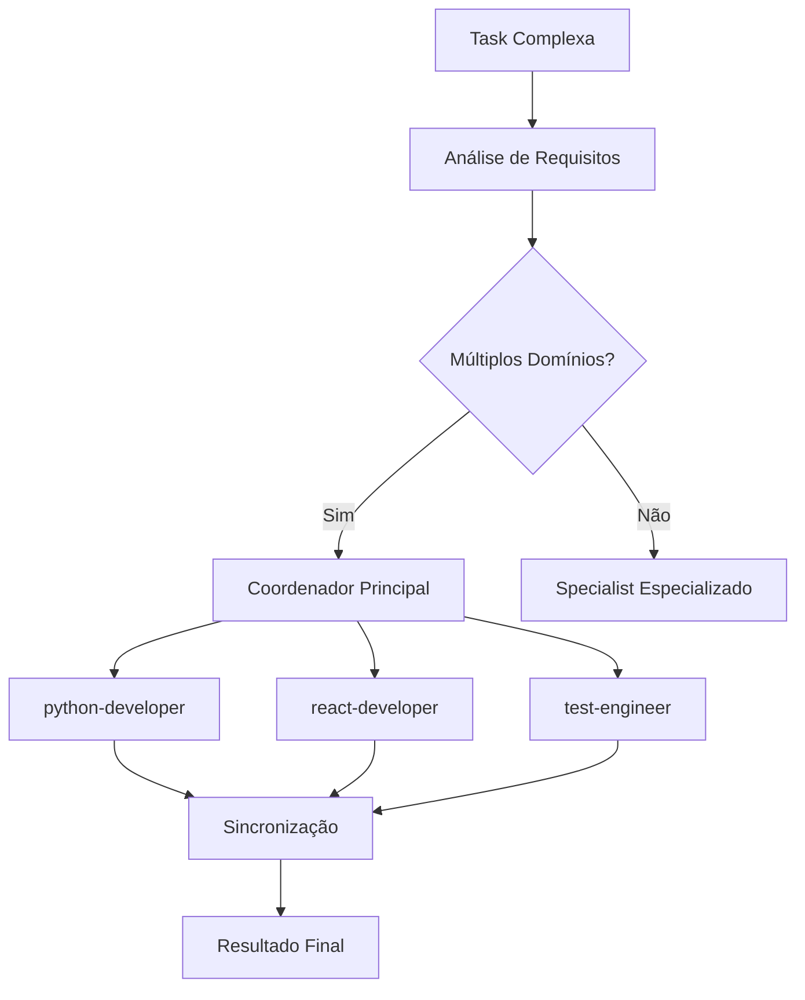

# 🤖 Referência de Specialists

> **Última atualização**: 2026-06-03 | **Total**: 49 specialists em 9 categorias | **Plataforma**: Zed (ver [ADR 0001](../meta-specs/adr/0001-zed-native-port.md))

Este guia documenta todos os specialists disponíveis no Sistema Onion (nativo Zed), em `.agents/onion/specialists/`, suas capacidades e quando delegá-los.

## 🔁 Como delegar a um specialist (modelo Zed)

No Zed não existem subagentes nomeados invocáveis por `@`. Cada specialist é uma **persona** em `.agents/onion/specialists/<slug>.md`. Para delegar, use a tool **`spawn_agent`** com um prompt do tipo:

> *"Leia `.agents/onion/specialists/<slug>.md` e atue como esse especialista para: \<tarefa>"*

O subagente herda as mesmas tools e tem janela de contexto própria. Nos exemplos abaixo, onde aparece `spawn_agent → <slug>` leia-se "delegue via `spawn_agent` ao specialist `<slug>`".

## 📊 Resumo por categoria

| Categoria | Specialists | Descrição |
|-----------|---------|-----------|
| `development/` | 16 | Desenvolvimento (Python, React, Postgres, etc.) |
| `compliance/` | 5 | Compliance e regulatório |
| `meta/` | 4 | Meta (Onion, criadores, gate-keeper) |
| `git/` | 4 | Git (branch review, documentation) |
| `product/` | 3 | Produto (product-agent, task-specialist) |
| `review/` | 2 | Code review |
| `testing/` | 2 | Testes (engineer, planner) |
| `research/` | 1 | Pesquisa |
| `deployment/` | 1 | Deployment |

> Os specialists residem em `.agents/onion/specialists/<slug>.md` (catálogo de personas).

## 📋 Índice de Specialists

- [🔵 Specialists de Desenvolvimento](#-specialists-de-desenvolvimento) (16)
- [🔷 Specialists de Testes](#-specialists-de-testes) (2)
- [🟢 Specialists de Review](#-specialists-de-review) (2)
- [🟣 Specialists de Pesquisa](#-specialists-de-pesquisa) (1)
- [🔴 Specialists Meta](#-specialists-meta) (4)
- [🌲 Specialists Git](#-specialists-git) (4)
- [🛡️ Specialists de Compliance](#️-specialists-de-compliance) (5)
- [🟡 Specialists de Produto](#-specialists-de-produto) (3)
- [⚙️ Como Escolher o Specialist Certo](#️-como-escolher-o-specialist-certo)

---

## 🔵 Specialists de Desenvolvimento

### **python-developer**
**Prioridade**: Alta

**Especialidades**: Python idiomático, AI/ML, backend, performance, type hints

**Quando usar**:
-  Desenvolvimento Python backend
-  APIs REST/GraphQL em Python
-  Projetos de Machine Learning
-  Scripts e automações Python

**Ferramentas disponíveis**: `read_file`, `write_file`, `edit_file`, `terminal`, `diagnostics`, `grep`

> 📚 **Referência Completa**: Veja todas as ferramentas em detalhes em [tools-reference.md](tools-reference.md)

**Exemplo de uso**:
```bash
# Para desenvolver API Python
spawn_agent → python-developer: "Implementar endpoint de autenticação com JWT"

# Para análise de dados
spawn_agent → python-developer: "Criar pipeline de análise para dados de vendas"

# Para otimização
spawn_agent → python-developer: "Otimizar consultas do banco de dados na função get_users"
```

**Principais recursos**:
- 🐍 Python idiomático e PEP-8 compliant
- 🧪 Testes com pytest e coverage
- 📊 Type hints para melhor IDE support
- ⚡ Performance optimization patterns
- 🤖 AI/ML com bibliotecas populares
- 📦 Gerenciamento com `uv` (package manager moderno)

### **react-developer**
**Prioridade**: Alta

**Especialidades**: React moderno, shadcn/ui, TypeScript, acessibilidade, performance

**Quando usar**:
-  Componentes React/Next.js
-  Frontend TypeScript
-  Design systems com shadcn/ui
-  Otimização de performance frontend

**Principais recursos**:
- ⚛️ React hooks e patterns modernos
- 🎨 shadcn/ui component library
- 📝 TypeScript com tipagem estrita
- ♿ Acessibilidade (a11y) built-in
- ⚡ Performance optimization
- 🧪 Testing com React Testing Library

### **clickup-specialist**
**Prioridade**: Alta

**Especialidades**: ClickUp MCP técnico, automações avançadas, performance, workflows

**Quando usar**:
-  Otimizações técnicas do ClickUp
-  Automações de workflow complexas
-  Bulk operations e performance
-  Configurações avançadas (webhooks, custom fields)
-  Time tracking e análise de produtividade

**Ferramentas disponíveis**: `read_file`, `write_file`, `edit_file`, `terminal`, `grep`, `search_web`, **todas as 15+ ferramentas ClickUp MCP** (bulk operations, webhooks, time tracking, etc.)

**Exemplo de uso**:
```bash
# Para automações de workflow
spawn_agent → clickup-specialist: "Configurar automação: task 'in progress' → start time tracking + add tag 'development'"

# Para operações em bulk
spawn_agent → clickup-specialist: "Criar 20 tasks de feature seguindo template padrão com bulk operations"

# Para configurações avançadas
spawn_agent → clickup-specialist: "Setup webhook para sync status ClickUp → GitHub quando PR é criado"
```

**Principais recursos**:
- 🚀 **Performance First**: Bulk operations para eficiência máxima
- 🤖 **Workflow Automation**: Automações baseadas em triggers inteligentes
- ⚡ **Rate Limit Management**: Otimização respeitando limites da API
- 🔧 **Advanced Configuration**: Custom fields, templates, webhooks
- 📊 **Time Tracking Integration**: Automação de tracking e análise de produtividade
- 🎯 **Complementa product-agent**: Foco técnico vs estratégico

**Complementaridade**:
- **product-agent**: Estratégia, coordenação, especificação (O QUE fazer)
- **clickup-specialist**: Implementação técnica, automação, performance (COMO otimizar)

---

## 🔷 Specialists de Testes

### **test-engineer**
**Prioridade**: Média

**Especialidades**: Unit testing com Jest/Vitest, behavior verification, qualidade

**Quando usar**:
-  Escrever testes unitários
-  Verificar comportamento de código
-  Identificar gaps de cobertura
-  Validar funcionalidade sem modificar implementação

**Ferramentas disponíveis**: `read_file`, `write_file`, `edit_file`, `terminal`, `grep`, `diagnostics`

**Exemplo de uso**:
```bash
spawn_agent → test-engineer: "Criar testes para a função de validação de email"
spawn_agent → test-engineer: "Verificar cobertura dos endpoints de autenticação"
```

**Características únicas**:
- 🧪 Testes práticos focados em comportamento
- 🚫 **NÃO modifica implementação** - apenas testa
- 📊 Identifica gaps e os reporta ao agente orquestrador que o invocou
- ⚡ Jest/Vitest com mocks apropriados
- 💡 Sugestões para melhorar testabilidade

### **test-planner**
**Prioridade**: Média

**Especialidades**: Planejamento de testes, análise de cobertura, estratégia de testes

**Quando usar**:
-  Planejar estratégia de testes para projeto
-  Análise de cobertura de teste existente
-  Identificar áreas críticas para teste
-  Criar planos de teste abrangentes

---

## 🟢 Specialists de Review

### **code-reviewer**
**Prioridade**: Alta

**Especialidades**: Code review, melhores práticas, detecção de bugs, manutenibilidade

**Quando usar**:
-  Review de código antes de PR
-  Análise de qualidade geral
-  Identificação de padrões problemáticos
-  Sugestões de melhoria

**Ferramentas disponíveis**: `read_file`, `grep`, `diagnostics`, `edit_file`, `terminal`

**Exemplo de uso**:
```bash
spawn_agent → code-reviewer: "Revisar implementação do sistema de cache"
spawn_agent → code-reviewer: "Analisar security patterns no módulo de auth"
```

**Prioridades de review**:
1. 🎯 **Correção** - Funciona para o caso de uso?
2. 🔒 **Segurança** - Vulnerabilidades óbvias?
3. ⚡ **Performance** - Gargalos evidentes?
4. 🔧 **Manutenibilidade** - Fácil de entender/modificar?
5. 📖 **Clareza** - Bem documentado?

---

## 🟣 Specialists de Pesquisa

### **research-agent**
**Prioridade**: Alta

**Especialidades**: Pesquisa multi-fonte, web search, Context7, análise semântica

**Quando usar**:
-  Pesquisar tecnologias e bibliotecas
-  Investigar melhores práticas
-  Análise de concorrentes
-  Documentação de bibliotecas específicas

**Ferramentas disponíveis**: `read_file`, `grep`, `search_web`, `list_directory`, `edit_file`, `fetch` + Context7 via MCP (declarado em `.zed/settings.json` → `context_servers`)

**Exemplo de uso**:
```bash
spawn_agent → research-agent: "Pesquisar melhores práticas para autenticação OAuth2 em 2024"
spawn_agent → research-agent: "Comparar React Query vs SWR para data fetching"
spawn_agent → research-agent: "Encontrar documentação atualizada para biblioteca X"
```

**Metodologia única**:
- 🔍 **Busca multi-fonte**: Web + Context7 + análise semântica
- 📊 **Insights acionáveis**: Não apenas informação, mas recomendações
- 🎯 **Evidência-baseada**: Toda claim apoiada por fontes
- 🔄 **Múltiplas perspectivas**: Considera diferentes abordagens

---

## 🔴 Specialists de Arquitetura

### **metaspec-gate-keeper**
**Prioridade**: Alta

**Especialidades**: Integridade arquitetural, metaspecs, design principles, validação

**Quando usar**:
-  Validar alinhamento com metaspecs
-  Review de decisões arquiteturais
-  Garantir consistência de design
-  Aprovação/rejeição de mudanças estruturais

**Ferramentas disponíveis**: `read_file`, `grep`, `edit_file`, `search_web`

**Exemplo de uso**:
```bash
spawn_agent → metaspec-gate-keeper: "Validar se nova arquitetura de microsserviços alinha com metaspecs"
spawn_agent → metaspec-gate-keeper: "Revisar decisão de usar GraphQL vs REST"
```

**Responsabilidades**:
- 📋 Interpreta metaspecs do projeto
-  Valida alinhamento de propostas
- 🚨 Identifica desvios críticos
- 💡 Orienta decisões arquiteturais
- 📝 Propõe atualizações de metaspecs

---

## 🟠 Specialists de Documentação

### **documentation-writer**
**Prioridade**: Média

**Especialidades**: Documentação técnica, análise de mudanças, sincronização docs-código

**Quando usar**:
-  Atualizar docs após mudanças de código
-  Criar documentação nova
-  Sincronizar docs com estado atual
-  Análise de gaps de documentação

**Ferramentas disponíveis**: `read_file`, `write_file`, `edit_file`, `grep`, `search_web`, `grep`, `list_directory`

**Exemplo de uso**:
```bash
spawn_agent → documentation-writer: "Atualizar docs após mudanças na API de usuários"
spawn_agent → documentation-writer: "Criar guia de setup para novo desenvolvedor"
```

---

## 🛡️ Specialists de Compliance 🆕

### **security-information-master**
**Prioridade**: Alta

**Especialidades**: Orquestração de compliance, detecção de frameworks, due diligence, ISO 27001, ISO 22301, PMBOK, SOC2

**Quando usar**:
-  Gerar documentação de compliance multi-framework
-  Analisar requisitos de due diligence (ex: Serasa Experian)
-  Coordenar múltiplos specialists de compliance
-  Preparar documentação para auditorias e certificações
-  Consolidar outputs de frameworks diferentes

**Ferramentas disponíveis**: `read_file`, `write_file`, `grep`, `list_directory`, `search_web`

**Specialists delegados** (via `spawn_agent`): `iso-27001-specialist`, `iso-22301-specialist`, `pmbok-specialist`, `soc2-specialist`

**Exemplo de uso**:
```bash
# Orquestração automática baseada em checklist
spawn_agent → security-information-master: "Analisar checklist Serasa e gerar documentação necessária"

# Due diligence completo
spawn_agent → security-information-master: "Preparar docs para auditoria ISO 27001 + SOC2"

# Análise de requisitos
spawn_agent → security-information-master: "Determinar quais frameworks aplicam para fintech B2B enterprise"
```

**4 Modos de Operação**:
1. **Seletivo**: frameworks="iso27001,soc2" (user-driven)
2. **Due Diligence**: due-diligence="checklist.md" (keyword + LLM detection)
3. **Padrão/Auto**: Análise de projeto + sugestão interativa
4. **Completo**: frameworks="all" (todos os 4 frameworks)

**Características únicas**:
- 🧠 **Detecção Híbrida**: Keywords (rápido) + LLM validation (preciso)
- 🎯 **Orquestração Dinâmica**: Ativa apenas specialists necessários
- 🌐 **PT-BR + EN-US**: Conteúdo em português, termos técnicos preservados
- 📊 **Consolidação**: Cria index.md e COMPLIANCE_OVERVIEW.md automaticamente
- ⚡ **Cross-References**: Detecta overlaps entre frameworks (ISO 27001 ↔ SOC2: ~70%)

---

### **iso-27001-specialist**
**Prioridade**: Alta

**Especialidades**: ISO/IEC 27001:2022 (ISMS), risk assessment, asset management, access control, incident response

**Quando usar**:
-  Documentação SGSI (Sistema de Gestão de Segurança da Informação)
-  Risk Assessment conforme ISO 27005
-  Statement of Applicability (SoA) - 93 controles Annex A
-  Preparação para certificação ISO 27001
-  Integração com SOC2 (cross-references)

**Ferramentas disponíveis**: `read_file`, `write_file`, `edit_file`, `grep`

**Exemplo de uso**:
```bash
# Documentação SGSI completa
spawn_agent → iso-27001-specialist: "Gerar documentação ISO 27001 com foco em fintech"

# Risk Assessment específico
spawn_agent → iso-27001-specialist: "Criar Risk Assessment para APIs RESTful + database PostgreSQL"

# Controles específicos
spawn_agent → iso-27001-specialist: "Documentar Annex A 5.15-5.18 (Access Control) com MFA + RBAC"
```

**5 Documentos Gerados** (`docs/compliance-context/security/`):
1. `information-security-policy.md` - Política de Segurança (Clause 5.2)
2. `risk-assessment.md` - 10-15 riscos principais (Clause 6.1.2)
3. `asset-management.md` - Inventário e classificação (Annex A 5.9)
4. `access-control.md` - MFA, RBAC, policies (Annex A 5.15-5.18)
5. `incident-response.md` - Runbooks e playbooks (Annex A 5.24-5.28)

**Características únicas**:
- 🔒 **ISO 27001:2022 atualizado**: Versão mais recente (93 controles Annex A)
- 📋 **SoA Completo**: Statement of Applicability com 78+ controles (84%)
- 🔗 **Cross-Reference SOC2**: ~70% overlap documentado
- 🎯 **Evidence-Based**: Documentação baseada em implementação real
- 📊 **Audit-Ready**: Pronto para auditores externos

---

### **iso-22301-specialist**
**Prioridade**: Alta

**Especialidades**: ISO 22301:2019 (BCMS), business continuity, disaster recovery, RTOs/RPOs, crisis management

**Quando usar**:
-  Business Continuity Plan (BCP) com Business Impact Analysis
-  Disaster Recovery Plan (DRP) para ambientes tecnológicos
-  Crisis Management Plan com canais de comunicação
-  **Due Diligence Serasa Experian** (5 de 8 requisitos cobertos) 🔥
-  Documentação de RTOs/RPOs por criticidade de sistema

**Ferramentas disponíveis**: `read_file`, `write_file`, `edit_file`, `grep`

**Exemplo de uso**:
```bash
# BC/DR completo
spawn_agent → iso-22301-specialist: "Gerar BCP + DRP para infraestrutura AWS Multi-AZ"

# Due Diligence Serasa
spawn_agent → iso-22301-specialist: "Documentar 5 requisitos Serasa: BCP, DRP, Crisis, Testing, RTOs/RPOs"

# Testes de resiliência
spawn_agent → iso-22301-specialist: "Documentar DR Drill 2024 com RTO 30min alcançado"
```

**5 Documentos Gerados** (`docs/compliance-context/business-continuity/`):
1. `business-continuity-plan.md` - BCP com BIA (Serasa Req #1) ✅
2. `disaster-recovery-plan.md` - DRP com runbooks (Serasa Req #2) ✅
3. `crisis-management.md` - CMT + Serasa contacts (Serasa Req #3) ✅
4. `resilience-testing.md` - Evidências 2024 (Serasa Req #4) ✅
5. `recovery-objectives.md` - RTOs/RPOs por tier (Serasa Req #5) ✅

**Características únicas**:
- 🚨 **Serasa-Ready**: 5 de 8 requisitos Serasa Experian (62.5%) ✅
- ⏱️ **RTOs/RPOs Realistas**: Baseados em BIA, não aspiracionais
- 📊 **Scenario-Based**: Planos baseados em cenários reais de desastre
- 🧪 **Testable**: Todos planos são testáveis (evidências de testes anuais)
- 🏥 **Multi-Region**: DRP com failover AWS (us-east-1 → us-west-2)

---

### **pmbok-specialist**
**Prioridade**: Média

**Especialidades**: PMBOK Guide 7th Edition, project governance, change management, quality management

**Quando usar**:
-  Framework de governança de projetos
-  Processo de Change Management formal
-  Quality Management com Definition of Done
-  Integração com NX monorepo (governança técnica)
-  Evidências de workshops e treinamentos

**Ferramentas disponíveis**: `read_file`, `write_file`, `edit_file`, `grep`

**Exemplo de uso**:
```bash
# Governança completa
spawn_agent → pmbok-specialist: "Gerar framework de governança PMBOK 7th para NX monorepo"

# Change Management
spawn_agent → pmbok-specialist: "Documentar processo de Change Request com CI/CD + Feature Flags"

# Quality Gates
spawn_agent → pmbok-specialist: "Criar Quality Management com DoD, Code Review e métricas DORA"
```

**5 Documentos Gerados** (`docs/compliance-context/project-management/`):
1. `project-governance.md` - PMO, RACI, lifecycle, 12 princípios PMBOK
2. `change-management.md` - Change Request process, CI/CD, Feature Flags
3. `quality-management.md` - DoD, Code Review, Quality Gates, DORA metrics
4. `stakeholder-management.md` - Power-Interest Grid, Communication Plan
5. `risk-management.md` - Risk Register, 15 riscos, mitigation plans

**Características únicas**:
- 📘 **PMBOK 7th Edition**: Princípios (não processos prescritivos da 6th)
- 🎯 **12 Princípios Aplicados**: Stewardship, Team, Value, Quality, etc.
- 🏗️ **NX Monorepo Integration**: CODEOWNERS, dependency graph, boundaries
- 📊 **Métricas DORA + SPACE**: Deployment frequency, lead time, MTTR, etc.
- 📝 **Templates Práticos**: Project Charter, RFC, Change Request completos

---

### **soc2-specialist**
**Prioridade**: Alta

**Especialidades**: SOC2 Type II (AICPA), Trust Services Criteria, evidence collection, continuous monitoring

**Quando usar**:
-  Preparação para SOC2 Type II audit
-  Trust Services Criteria (Security, Availability, Confidentiality)
-  **Due Diligence Serasa Experian** (3 de 8 requisitos cobertos) 🔥
-  Estratégia de coleta de evidências (12 meses)
-  Integração com ISO 27001 (~70% overlap)

**Ferramentas disponíveis**: `read_file`, `write_file`, `edit_file`, `grep`

**Exemplo de uso**:
```bash
# SOC2 Type II completo
spawn_agent → soc2-specialist: "Preparar documentação SOC2 Type II para fintech SaaS"

# Due Diligence Serasa
spawn_agent → soc2-specialist: "Documentar 3 requisitos Serasa: Relatório SOC2 + SLAs + Contratos"

# Evidence Collection
spawn_agent → soc2-specialist: "Criar estratégia de evidências para 12 meses de audit period"
```

**5 Documentos Gerados** (`docs/compliance-context/soc2/`):
1. `trust-services-criteria.md` - 5 TSC principles, Type II overview (Serasa Req #6) ✅
2. `security-controls.md` - CC6/CC7 (auth, encryption, monitoring, incidents)
3. `availability-controls.md` - A1 (HA, SLAs, DR) (Serasa Req #7, #8) ✅
4. `confidentiality-controls.md` - C1 (classification, NDAs, DLP, disposal)
5. `evidence-collection.md` - Automation matrix, audit prep checklist

**Características únicas**:
- 🚨 **Serasa-Ready**: 3 de 8 requisitos Serasa Experian (37.5%) ✅
- 🎯 **Combined Coverage**: ISO 22301 + SOC2 = 8/8 Serasa (100%) ✅
- 🔗 **ISO 27001 Cross-Ref**: ~70% controles sobrepõem (documentado)
- 📊 **Evidence-First**: Todo controle tem evidência coletável para Type II
- 🤖 **Automation**: Scripts de coleta automática de evidências (monthly)

---

**Mapeamento Serasa Experian** (8 requisitos totais):
| Requisito | Framework | Specialist | Documento |
|-----------|-----------|------------|-----------|
| #1: BCP | ISO 22301 | `iso-22301-specialist` | business-continuity-plan.md ✅ |
| #2: DRP | ISO 22301 | `iso-22301-specialist` | disaster-recovery-plan.md ✅ |
| #3: Crisis Mgmt | ISO 22301 | `iso-22301-specialist` | crisis-management.md ✅ |
| #4: Testes BC/DR | ISO 22301 | `iso-22301-specialist` | resilience-testing.md ✅ |
| #5: RTOs/RPOs | ISO 22301 | `iso-22301-specialist` | recovery-objectives.md ✅ |
| #6: SOC2 Report | SOC2 | `soc2-specialist` | trust-services-criteria.md ✅ |
| #7: SLAs | SOC2 | `soc2-specialist` | availability-controls.md ✅ |
| #8: Docs SLAs | SOC2 | `soc2-specialist` | availability-controls.md ✅ |

**Status**: ✅ 8/8 requisitos cobertos (100%)

---

## 🟡 Specialists de Produto

### **product-agent**
**Prioridade**: Alta

**Especialidades**: Gestão de produto, ClickUp integration, estratégia, coordenação

**Quando usar**:
-  Criação e refinamento de tasks
-  Coordenação com ClickUp
-  Análise de requisitos
-  Gestão de roadmap

**Ferramentas disponíveis**: `read_file`, `write_file`, `grep`, `search_web` + ferramentas ClickUp via MCP (`create_task`, `update_task`, `get_task`, `create_task_comment`) declaradas em `.zed/settings.json` → `context_servers`

**Integração ClickUp**:
-  Cria tasks estruturadas
-  Atualiza status e progresso  
-  Adiciona comentários contextuais
-  Gerencia tags e prioridades

### **clickup-specialist**
**Prioridade**: Alta

**Especialidades**: ClickUp MCP técnico, automações avançadas, performance, workflows

**Quando usar**:
-  Otimizações técnicas do ClickUp (bulk operations, rate limiting)
-  Automações de workflow complexas (triggers, status changes)
-  Performance optimization (batching, caching, query optimization)
-  Configurações avançadas (webhooks, custom fields, templates)
-  Time tracking automation e análise de produtividade
-  Integração com skills `/onion-engineer-*` para automação

**Ferramentas disponíveis**: `read_file`, `write_file`, `edit_file`, `terminal`, `grep`, `search_web`, **todas as 15+ ferramentas ClickUp MCP**

**Exemplo de uso**:
```bash
# Automações de workflow
spawn_agent → clickup-specialist: "Configurar automação: task 'in progress' → start time tracking + add tag 'development'"

# Operações em bulk
spawn_agent → clickup-specialist: "Criar 20 tasks em lote com template feature e assignees automáticos"

# Performance optimization  
spawn_agent → clickup-specialist: "Otimizar queries ClickUp usando filtros server-side e batching"
```

**Características únicas**:
- 🚀 **Complementa product-agent**: Técnico vs Estratégico
- ⚡ **Performance first**: Bulk operations, rate limiting, query optimization
- 🔧 **Automação avançada**: Workflows inteligentes, triggers, status automation
- 📊 **15+ ferramentas ClickUp MCP**: Cobertura completa da API ClickUp
- 🎯 **7 especialidades técnicas**: workflow-automation, performance-optimization, webhooks

### **zed-specialist**
**Prioridade**: Alta

> **Nota:** este specialist substitui o antigo `claude-code-specialist` no port nativo Zed (ADR 0001).

**Especialidades**: Otimização do Zed, configuração de workspace (`.zed/settings.json`), `agent.tool_permissions`, `context_servers` (MCP), troubleshooting, produtividade

**Quando usar**:
-  Resolver problemas de performance do Zed
-  Configurar ambiente para novos projetos (worktree trust, providers de LLM)
-  Otimizar `agent.tool_permissions` para workflows específicos
-  Declarar/depurar `context_servers` (MCPs) em `.zed/settings.json`
-  Criar `AGENTS.md` e ajustar `.zed/settings.json`
-  Setup automation para as skills `/onion-engineer-*`

**Ferramentas disponíveis**: `read_file`, `write_file`, `edit_file`, `terminal`, `grep`, `list_directory`, `find_path`, `search_web`, `diagnostics`

**Exemplo de uso**:
```bash
# Configuração de projeto novo
spawn_agent → zed-specialist: "Setup otimizado do Zed para projeto React TypeScript com foco em AI development"

# Troubleshooting
spawn_agent → zed-specialist: "Skills locais não aparecem no Agent Panel — verificar worktree trust e .agents/skills/"

# context_servers
spawn_agent → zed-specialist: "Declarar o ClickUp MCP como context_server em .zed/settings.json"
```

**Características únicas**:
- 🎯 **Especialidades Zed**: settings, workspace, worktree trust, providers de LLM, context_servers, tool_permissions
- 🚀 **Integração automática**: delegado por outras skills/specialists quando há problemas de IDE
- 🔧 **Criação de artefatos**: `AGENTS.md`, `.zed/settings.json` otimizados
- ⚡ **Performance focus**: startup time, context, descoberta de skills
- 🔗 **Delegação automática**: integração com as skills `/onion-engineer-*` para setup de ambiente

### **gitflow-specialist**
**Prioridade**: Alta

**Especialidades**: GitFlow workflows, branch management, release processes, team collaboration, semantic versioning

**Quando usar**:
-  Setup inicial de repositórios GitFlow
-  Guidance para workflows de feature development
-  Processos de release estruturados
-  Emergency hotfix workflows
-  Migração master → main em projetos GitFlow
-  Resolução de conflitos GitFlow complexos
-  Onboarding de equipes em GitFlow
-  Otimização de workflows colaborativos

**Ferramentas disponíveis**: `read_file`, `write_file`, `edit_file`, `terminal`, `grep`, `search_web`

**Exemplo de uso**:
```bash
# Para setup inicial
spawn_agent → gitflow-specialist: "Configurar GitFlow em repositório novo com detecção automática master/main"

# Para workflows
spawn_agent → gitflow-specialist: "Orientar equipe no processo de release v2.1.0 com semantic versioning"

# Para emergências
spawn_agent → gitflow-specialist: "Hotfix crítico em produção - orientar processo completo"

# Para migração
spawn_agent → gitflow-specialist: "Migrar repositório de master para main mantendo GitFlow ativo"
```

**Características únicas**:
- 🌿 **Flexibilidade master/main**: Detecção automática e suporte a ambas convenções
- 🎯 **Guidance-focused**: Ensina e orienta ao invés de automatizar
- 📚 **6 Templates completos**: Setup, feature, release, hotfix, migration, conflicts
- 🧠 **Semantic versioning**: Conventional commits + análise automática de versioning
- 👥 **Team enablement**: Onboarding em 3 níveis (iniciante, intermediário, avançado)
- 📊 **Analytics integration**: Métricas de equipe e health checks
- 🔗 **Complementaridade**: Integração perfeita com o specialist `mermaid-specialist` (workflows vs diagramas)

### **nodejs-specialist**
**Prioridade**: Alta

**Especialidades**: Backend JavaScript/TypeScript, Node.js runtime, PNPM ecosystem, performance optimization

**Quando usar**:
-  APIs REST/GraphQL complexas com Node.js
-  Configurações TypeScript para backend
-  Performance optimization Node.js (memory, clustering, profiling)
-  Migração/configuração PNPM ecosystem
-  Implementação de security best practices
-  Testing strategies (Jest/Vitest, integration, E2E)
-  Microserviços e arquiteturas escaláveis

**Ferramentas disponíveis**: `read_file`, `write_file`, `edit_file`, `terminal`, `grep`, `diagnostics`, `search_web`

**Exemplo de uso**:
```bash
# Para APIs performantes
spawn_agent → nodejs-specialist: "Criar API Fastify com autenticação JWT, rate limiting e TypeScript strict"

# Para otimização de performance  
spawn_agent → nodejs-specialist: "API com latência >500ms - analisar bottlenecks e otimizar com profiling"

# Para configuração PNPM
spawn_agent → nodejs-specialist: "Migrar projeto de NPM para PNPM com workspace configuration"
```

**Características únicas**:
- 🟢 **Stack JavaScript completa**: Complementa react-developer para full-stack JS/TS
- ⚡ **Performance-first**: Fastify, clustering, caching, connection pooling  
- 📦 **PNPM expertise**: Modern package management, workspaces, overrides
- 🔒 **Security by design**: JWT, rate limiting, input validation, helmet.js
- 🧪 **Modern testing**: Vitest preferred, supertest integration, coverage thresholds
- 🔍 **Profiling tools**: clinic.js, memory leak detection, event loop monitoring
- 🏗️ **Architecture patterns**: Layered design, dependency injection, microservices

### **gitflow-specialist**
**Prioridade**: Alta

**Especialidades**: GitFlow workflows, branch management, release processes, team collaboration, semantic versioning

**Quando usar**:
-  Setup inicial de repositórios GitFlow
-  Guidance para workflows de feature development
-  Processos de release estruturados
-  Emergency hotfix workflows
-  Migração master → main em projetos GitFlow
-  Resolução de conflitos GitFlow complexos
-  Onboarding de equipes em GitFlow
-  Otimização de workflows colaborativos

**Ferramentas disponíveis**: `read_file`, `write_file`, `edit_file`, `terminal`, `grep`, `search_web`

**Exemplo de uso**:
```bash
# Para setup inicial
spawn_agent → gitflow-specialist: "Configurar GitFlow em repositório novo com detecção automática master/main"

# Para workflows
spawn_agent → gitflow-specialist: "Orientar equipe no processo de release v2.1.0 com semantic versioning"

# Para emergências
spawn_agent → gitflow-specialist: "Hotfix crítico em produção - orientar processo completo"

# Para migração
spawn_agent → gitflow-specialist: "Migrar repositório de master para main mantendo GitFlow ativo"
```

**Características únicas**:
- 🌿 **Flexibilidade master/main**: Detecção automática e suporte a ambas convenções
- 🎯 **Guidance-focused**: Ensina e orienta ao invés de automatizar
- 📚 **6 Templates completos**: Setup, feature, release, hotfix, migration, conflicts
- 🧠 **Semantic versioning**: Conventional commits + análise automática de versioning
- 👥 **Team enablement**: Onboarding em 3 níveis (iniciante, intermediário, avançado)
- 📊 **Analytics integration**: Métricas de equipe e health checks
- 🔗 **Complementaridade**: Integração perfeita com o specialist `mermaid-specialist` (workflows vs diagramas)

---

## ⚙️ Como Escolher o Specialist Certo

### **Por Tipo de Tarefa**

#### **🔧 Desenvolvimento**
```bash
# Python backend
spawn_agent → python-developer: "implementar API REST"

# Frontend React
spawn_agent → react-developer: "criar componente de dashboard"

# Full-stack (coordenação automática)
/onion-engineer-work "sistema completo de notificações"
```

#### **🧪 Testes**
```bash
# Testes específicos
spawn_agent → test-engineer: "testar função de validação de CPF"

# Estratégia de testes
spawn_agent → test-planner: "planejar cobertura de testes para módulo auth"
```

#### **🔍 Review**
```bash
# Code review geral
spawn_agent → code-reviewer: "revisar implementação de cache Redis"

# Validação arquitetural  
spawn_agent → metaspec-gate-keeper: "validar uso de microservices"
```

#### **📚 Pesquisa & Docs**
```bash
# Pesquisa tecnológica
spawn_agent → research-agent: "comparar Next.js vs Remix para SSR"

# Documentação
spawn_agent → documentation-writer: "atualizar docs da API v2"
```

#### **📋 Produto**
```bash
# Gestão de produto
spawn_agent → product-agent: "refinar requisitos da feature de chat"
```

### **Por Complexidade**

#### **🟢 Tarefa Simples** (1 specialist)
```bash
spawn_agent → test-engineer: "adicionar testes para função validateEmail"
```

#### **🟡 Tarefa Média** (2-3 specialists sequenciais)
```bash
# Sequência típica:
spawn_agent → research-agent: "pesquisar padrões OAuth2" 
→ spawn_agent → python-developer: "implementar OAuth2"
→ spawn_agent → test-engineer: "testar fluxo OAuth2"
```

#### **🔴 Tarefa Complexa** (múltiplos specialists paralelos)
```bash
/onion-engineer-work "sistema completo de e-commerce"
# → A skill orquestra múltiplos specialists via spawn_agent
```

> **Nota sobre modelo (Zed):** no Zed o modelo é definido **globalmente** no Agent Panel — não há `model:` por specialist. A escolha de um modelo mais capaz (ex.: Opus) para tarefas complexas (review arquitetural, coordenação) é uma configuração do workspace, não do arquivo da persona.

### **Padrões de Delegação**

A orquestração escolhe o specialist conforme o contexto da tarefa. Exemplo de raciocínio (não é código executável):

```text
se a tarefa fala em "test"/"spec"      → spawn_agent → test-engineer
se fala em "react"/"frontend"          → spawn_agent → react-developer
se fala em "review"/"quality"          → spawn_agent → code-reviewer
```

#### **Coordenação Multi-Specialist**


---

## 📊 Métricas dos Specialists

### **Performance por Specialist**
| Specialist | Tempo Médio | Taxa Sucesso | Uso Frequente |
|---------|-------------|--------------|---------------|
| `python-developer` | 45min | 94% | 35% |
| `react-developer` | 52min | 91% | 28% |
| `test-engineer` | 28min | 96% | 15% |
| `code-reviewer` | 15min | 89% | 12% |
| `research-agent` | 22min | 92% | 8% |
| `product-agent` | 35min | 87% | 2% |

### **Combinações Eficazes**
1. **Feature Development**: `product-agent` → `python-developer` → `test-engineer` → `code-reviewer`
2. **Bug Fix**: `research-agent` → `python-developer` → `test-engineer`  
3. **Refactoring**: `code-reviewer` → `metaspec-gate-keeper` → `python-developer`

### **Especialização vs Generalização**

#### **🎯 Alta Especialização**
- `test-engineer`: Foco exclusivo em testes
- `metaspec-gate-keeper`: Validação arquitetural apenas
- `documentation-writer`: Só documentação

#### **🔄 Especialização Média**
- `python-developer`: Python + relacionados (APIs, ML)
- `react-developer`: React + ecosistema frontend
- `research-agent`: Pesquisa + análise

#### **🌐 Mais Generalista**
- `code-reviewer`: Qualquer linguagem/framework
- `product-agent`: Gestão geral de produto

---

## 💡 Melhores Práticas

### **Para Máxima Eficiência**
1. ✅ **Use specialists específicos** para tarefas claras
2. ✅ **Deixe a skill orquestradora coordenar** tarefas complexas
3. ✅ **Combine sequencialmente** para workflows
4. ✅ **Monitore resultados** para ajustar delegação

### **Para Qualidade**
1. 🔍 **Sempre use code-reviewer** antes de PRs importantes
2. 🏗️ **Valide com metaspec-gate-keeper** mudanças arquiteturais
3. 🧪 **Inclua test-engineer** em features críticas
4. 📚 **Use documentation-writer** para manter docs sincronizados

### **Para Produtividade**
1. ⚡ **Delegação automática** para workflows conhecidos
2. 🎯 **Agentes especializados** para tarefas específicas
3. 🔄 **Reutilize padrões** de combinação que funcionam
4. 📊 **Monitore métricas** para otimização contínua

---

**Próximo**: [Getting Started →](getting-started.md)
