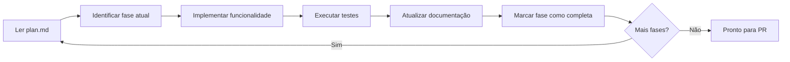
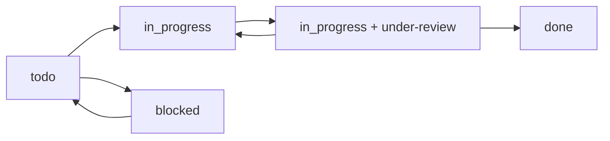

# 🔄 Fluxos de Engenharia Detalhados

> **Última atualização**: 2026-06-03 | **Plataforma**: Zed (ver [ADR 0001](../meta-specs/adr/0001-zed-native-port.md))

Este guia documenta os workflows completos de desenvolvimento, desde a concepção até a entrega, com skills `/onion-engineer-*` e delegação a specialists via `spawn_agent`, integrados ao **Task Manager Abstraction**. Todos os fluxos funcionam com qualquer provedor ativo (`TASK_MANAGER_PROVIDER`: `jira` | `clickup` | `asana` | `linear` | `none`); onde um detalhe for específico de um provedor, ele está marcado como tal.

> **Convenção de exemplos:** ao longo do guia usamos um ID genérico de task (`AUTH-123`). No provedor ativo isso corresponde a uma issue do Jira (`AUTH-123`), uma task do ClickUp, uma task do Asana ou uma issue do Linear. O ID exato segue o formato do provedor configurado.

## 🧩 Componentes-chave (nativo Zed)

- **Sessions estruturadas** em `.agents/onion/sessions/<feature-slug>/`
- **Comentários de progresso** na task do provedor ativo (detalhado + resumido)
  - _Específico do ClickUp:_ comentários duais usam formatação visual Unicode (ver adapter ClickUp)
  - _Específico do Jira:_ comentários e descrições são renderizados em ADF (Atlassian Document Format)
- **Mapeamento fase→subtask** automático
  - _Específico do ClickUp:_ o mapeamento usa subtasks nativas do ClickUp; em Jira corresponde a sub-tasks/issue links, em Linear a sub-issues, em Asana a subtasks
- **Prompts modulares** em `.agents/onion/prompts/`

## 📋 Índice de Fluxos

- [🚀 Fluxo Completo: Feature Development](#-fluxo-completo-feature-development)
- [🐛 Fluxo de Correção de Bugs](#-fluxo-de-correção-de-bugs)
- [📚 Fluxo de Documentação](#-fluxo-de-documentação)
- [🔧 Fluxo de Refatoração](#-fluxo-de-refatoração)
- [⚡ Fluxo de Hotfix](#-fluxo-de-hotfix)
- [🎯 Integração com Task Manager por Fluxo](#-integração-com-task-manager-por-fluxo)
- [🤖 Workflows com Specialists](#-workflows-com-specialists)

---

## 🚀 Fluxo Completo: Feature Development

### **Fase 1: Planejamento e Criação da Task**

#### 1.1 Criação da Task
```bash
/onion-product-task "Implementar sistema de autenticação OAuth2 com Google e GitHub"
```

**O que acontece**:
-  Sistema analisa requisitos e contexto do projeto
-  Cria task estruturada no **provedor ativo** com:
  - Título descritivo
  - Descrição detalhada (em ADF no Jira Cloud, Markdown no ClickUp/Linear, notes no Asana)
  - Critérios de aceitação
  - Estimativa inicial
  - Tags/labels relevantes (`feature`, `auth`, `oauth2`)
-  Task fica com status normalizado `to do` no provedor

**Output esperado** (exemplo com provedor ativo):
```
✅ Task criada (provider=jira): AUTH-123
📋 Título: "🔐 Implementar sistema de autenticação OAuth2"
📝 Descrição: Funcionalidade completa de autenticação...
🏷️ Tags/labels: feature, auth, oauth2, high-priority
📊 Estimativa: 8-12 horas
```

#### 1.2 Refinamento (Opcional)
```bash
/onion-product-refine
```

**Usar quando**:
- Requisitos iniciais não estão claros
- Funcionalidade é complexa e precisa de detalhamento
- Stakeholders precisam alinhar expectativas

### **Fase 2: Início do Desenvolvimento**

#### 2.1 Inicialização
```bash
/onion-engineer-start
```

**Input necessário**: ID da task no provedor ativo (`AUTH-123`)

**O que acontece**:
-  Verifica se está em feature branch apropriada
-  Cria pasta `.agents/onion/sessions/auth-oauth2/`
-  Busca detalhes da task no provedor ativo
-  Analisa contexto, objetivos e dependências
-  Identifica arquivos e componentes necessários
-  Cria plan.md inicial

**Estrutura criada**:
```
.agents/onion/sessions/auth-oauth2/
├── plan.md          # Plano de desenvolvimento em fases
├── context.md       # Contexto e requisitos
├── decisions.md     # Decisões arquiteturais
└── progress.md      # Log de progresso
```

#### 2.2 Análise Arquitetural (se necessário)
```bash
/onion-product-light-arch
```

**Usar quando**:
- Funcionalidade impacta arquitetura existente
- Novas integrações são necessárias
- Decisões técnicas precisam ser documentadas

### **Fase 3: Desenvolvimento Iterativo**

#### 3.1 Trabalho na Funcionalidade
```bash
/onion-engineer-work .agents/onion/sessions/auth-oauth2/
```

**O que acontece em cada iteração**:
-  Lê plan.md e identifica fase atual
-  Apresenta próximos passos específicos
-  Delega trabalho a specialists via `spawn_agent`:
  - `python-developer` para backend
  - `react-developer` para frontend
  - `test-engineer` para testes
-  Atualiza progresso no plan.md
-  Solicita validação antes de próxima fase

**Ciclo típico**:


#### 3.2 Validações Contínuas
Durante o desenvolvimento, o sistema:
- 🔍 Executa testes automaticamente após mudanças
- 📝 Atualiza documentação conforme necessário
- 🔗 Mantém rastreabilidade com a task no provedor ativo
- 📊 Monitora progresso e estima tempo restante

### **Fase 4: Preparação para Review**

#### 4.1 Validações Pré-PR
```bash
/onion-engineer-pre-pr
```

**Verificações realizadas**:
-  Todos os testes passando
-  Cobertura de testes adequada
-  Linting sem erros
-  Documentação atualizada
-  Commits organizados
-  Task sincronizada no provedor ativo

#### 4.2 Criação do Pull Request
```bash
/onion-engineer-pr
```

**O que acontece**:
1. ✅ Execução final de todos os testes
2. ✅ Commit final com mensagem padronizada
3. ✅ **Atualização no provedor ativo**: Task → `in_progress` + tag/label `under-review` (no Jira, via transition — nunca seta `status` direto)
4. ✅ Criação do PR com:
   - Descrição detalhada da implementação
   - Checklist de validações
   - Link para a task no provedor ativo
   - Screenshots/demos se aplicável
5. ✅ Aguarda feedback automatizado (3 min)
6. ✅ Processa comentários e sugere correções

**Template do PR**:
```markdown
## 🔐 Implementar sistema de autenticação OAuth2

### 📋 Resumo
- Implementado OAuth2 com Google e GitHub
- Adicionado middleware de autenticação
- Criados testes unitários e de integração

### 🔗 Relacionado
- Task (provedor ativo): AUTH-123
- Sessão: .agents/onion/sessions/auth-oauth2/

### ✅ Checklist
- [x] Testes passando
- [x] Documentação atualizada
- [x] Linting sem erros
- [x] Task atualizada no provedor ativo
```

### **Fase 5: Review e Finalização**

#### 5.1 Processamento de Feedback
Quando feedback é recebido:
- 🔍 Analisa cada comentário automaticamente
- 💡 Sugere correções específicas
- 🔄 Aplica mudanças aprovadas pelo usuário
-  Marca conversas como resolvidas

#### 5.2 Merge e Finalização
Após aprovação:
- 🔄 Merge do PR
-  **Atualização no provedor ativo**: Task → `done` (no Jira, via transition)
- 📝 Adição de comentário final com resumo
- 🏷️ Adição de tags de conclusão
- 📊 Atualização de métricas de tempo

---

## 🐛 Fluxo de Correção de Bugs

### **Início Rápido para Bugs**
```bash
# Para bugs simples (< 2h)
/onion-product-collect "Bug: Dashboard não carrega dados do usuário após login"
# → Análise rápida e criação de task
/onion-engineer-start
# → Desenvolvimento direto sem sessão complexa
/onion-engineer-work "correção dashboard login"
# → Fix implementado
/onion-engineer-pr
# → PR com correção
```

### **Fluxo Detalhado para Bugs Complexos**

#### 1. Investigação e Documentação
```bash
/onion-product-task "Bug: Dashboard não carrega após login em ambiente de produção"
```

**Informações coletadas**:
- 🔍 Steps to reproduce
- 📊 Dados de erro/logs
- 🎯 Impacto nos usuários
- ⏱️ Urgência da correção

#### 2. Análise Técnica
```bash
/onion-engineer-start  # ID da task de bug
```

**Análise específica para bugs**:
- 🕵️ Root cause analysis
- 📊 Análise de logs e métricas
- 🧪 Testes para reproduzir o problema
- 🔄 Identificação de possíveis regressões

#### 3. Implementação da Correção
```bash
/onion-engineer-work .agents/onion/sessions/bug-dashboard-login/
```

**Foco em**:
- 🎯 Correção mínima necessária
- 🧪 Testes para prevenir regressão
- 📝 Documentação do que causou o bug
- ⚡ Deploy rápido se crítico

#### 4. Validação Extensiva
```bash
/onion-engineer-pre-pr
```

**Validações específicas para bugs**:
-  Bug original corrigido
-  Nenhuma regressão introduzida
-  Testes de edge cases
-  Validação em ambiente similar à produção

---

## 📚 Fluxo de Documentação

### **Documentação Técnica**
```bash
/onion-docs-build-tech-docs
```

**Produz**:
- 📄 Architecture Decision Records (ADRs)
- 🗺️ Guia de navegação do codebase
- 🤖 Contexto otimizado para IA
- 📋 Guias de desenvolvimento

**Integração com Task Manager**:
-  Cria task de documentação no provedor ativo
- 📊 Organiza por workspace/space/projeto (conforme o provedor)
- 🏷️ Tags/labels por tipo de documentação

### **Documentação de Negócio**
```bash
/onion-docs-build-business-docs
```

**Produz**:
- 👥 Personas e jornadas de usuário
- 📈 Análise competitiva
- 🎯 Estratégia de produto
- 📋 Processos de vendas

---

## 🔧 Fluxo de Refatoração

### **Planejamento de Refatoração**
```bash
/onion-product-task "Refatoração: Migrar sistema de cache para Redis"
/onion-product-light-arch  # Planejar nova arquitetura
```

### **Execução Incremental**
```bash
/onion-engineer-start  # Task de refatoração
/onion-engineer-work   # Implementação por fases
```

**Características especiais**:
- 📊 Métricas de performance antes/depois
- 🧪 Testes de compatibilidade
- 📝 Documentação de migration path
- ⚡ Deploy incremental com feature flags

---

## ⚡ Fluxo de Hotfix

### **Hotfix Crítico (< 30min)**
```bash
# Criação urgente
/onion-product-collect "CRÍTICO: Sistema de pagamento fora do ar"

# Desenvolvimento express
/onion-engineer-start  # Branch hotfix/payment-fix
/onion-engineer-work "correção sistema pagamento"
/onion-engineer-pr     # PR de emergência

# Provedor ativo: Task marcada como URGENT + notificações
```

**Características do fluxo de hotfix**:
- 🚨 Prioridade máxima no provedor ativo
- ⚡ Branch `hotfix/*` automaticamente
- 🧪 Testes mínimos mas críticos
- 📢 Notificações para todos stakeholders
- 📊 Deploy direto para produção após approve

---

## 🎯 Integração com Task Manager por Fluxo

A integração abaixo é descrita em termos de **status normalizados**, que a abstração mapeia para o vocabulário de cada provedor. Itens marcados como _"específico do provedor X"_ não são universais.

### **Estados normalizados da Task (qualquer provedor)**



Status normalizados: `backlog` → `todo` → `in_progress` → `in_review` → `done` (mais `blocked` e `cancelled`). A abstração traduz para os status reais do provedor.

> **Específico do Jira:** mudanças de status nunca são setadas diretamente — são executadas via `POST /issue/{key}/transitions`, respeitando o workflow configurado.

### **Mapeamento de Comandos → Estados (status normalizados)**

| Comando | Estado Inicial | Estado Final | Tags/Labels Adicionadas |
|---------|---------------|-------------|------------------|
| `/onion-product-task` | - | `todo` | Baseado no tipo |
| `/onion-engineer-start` | `todo` | `in_progress` | `development` |
| `/onion-engineer-pr` | `in_progress` | `in_progress` | `under-review` |
| **Após merge** | `in_progress + under-review` | `done` | `completed` |
| **Se bloqueado** | Qualquer | `blocked` | `blocked` + razão |

### **Comentários Automáticos na Task**

O conteúdo dos comentários é o mesmo em qualquer provedor; o **formato de renderização** varia:

| Evento | Comentário Adicionado |
|--------|----------------------|
| Início desenvolvimento | "🚀 Desenvolvimento iniciado na branch: feature/auth-oauth2" |
| Progresso significativo | "📊 Fase X completada: [detalhes da implementação]" |
| PR criado | "🔍 Pull Request criado: [link] - Pronto para review" |
| PR aprovado | "✅ Pull Request aprovado e merged - Funcionalidade entregue" |
| Bug encontrado | "🐛 Bug identificado durante desenvolvimento: [detalhes]" |

**Formatação por provedor:**
- _Específico do ClickUp:_ comentários usam formatação visual Unicode (`━━━`, `∟`, `▶`, `◆`, `✅`) com timestamp + status obrigatórios — ver `.agents/onion/utils/task-manager/adapters/clickup.md`
- _Específico do Jira:_ comentários e descrições são enviados em ADF (JSON estruturado) — ver `adapters/jira.md`
- _Asana:_ notes em HTML (subset) ou plain text — ver `adapters/asana.md`
- _Linear:_ Markdown nativo (suporte rico) — ver `adapters/linear.md`

### **Subtasks por fase (hierarquia)**

O mapeamento fase→subtask existe em todos os provedores, com nomenclatura própria:

| Provedor | Mecanismo |
|----------|-----------|
| **Jira** | Sub-tasks ou issue links |
| **ClickUp** | Subtasks nativas (_específico do ClickUp:_ checklists nativos também são suportados via `/onion-product-checklist-sync`) |
| **Asana** | Subtasks |
| **Linear** | Sub-issues |

### **Campos Customizados Sincronizados**

> **Específico do provedor:** a sincronização granular de campos abaixo está implementada para o **ClickUp** (custom fields). Em Jira, mapeia-se para campos customizados / story points; em Asana, para custom fields do projeto; em Linear, para estimates/labels. Verifique o adapter do provedor para a cobertura exata.

| Campo | Origem | Atualização |
|-------|--------|-------------|
| **Tempo Estimado** | `/onion-product-task` análise | Refinado durante desenvolvimento |
| **Tempo Real** | Timer automático | Durante `/onion-engineer-work` |
| **Branch** | `/onion-engineer-start` | Nome da branch Git |
| **PR Link** | `/onion-engineer-pr` | Link direto do GitHub/GitLab |
| **Arquivos Alterados** | Análise Git | Lista de arquivos modificados |
| **Linhas de Código** | Análise Git | Stats de adição/remoção |

### **Notificações e Webhooks**

**Configurações recomendadas**:
- 📧 **Email**: Mudanças de status críticas
- 💬 **Slack**: Updates de desenvolvimento em canal do projeto  
- 📱 **Mobile**: Apenas para tasks URGENT/HIGH priority
- 🔔 **Desktop**: Pull Requests prontos para review

---

## 📊 Métricas e Relatórios

### **Métricas Coletadas Automaticamente**
- ⏱️ Tempo por fase de desenvolvimento
- 🧪 Cobertura de testes por funcionalidade
- 🔄 Frequência de revisões de código
- 📈 Velocity da equipe (story points/sprint)
- 🐛 Taxa de bugs encontrados pós-deploy

### **Dashboards / Relatórios Sugeridos** (qualquer provedor)
1. **Desenvolvimento Ativo**: Tasks in progress + tempo decorrido
2. **Pipeline de Review**: PRs aguardando review + tempo de espera
3. **Bugs e Hotfixes**: Tasks críticas + tempo de resolução
4. **Documentação**: Status de docs por projeto

---

## 💡 Melhores Práticas

### **Para Desenvolvimento Eficiente**
1. ✅ **Sempre use `/onion-product-task`** antes de começar desenvolvimento
2. ✅ **Execute `/onion-engineer-start`** para setup completo do ambiente
3. ✅ **Trabalhe em sessões focadas** com `/onion-engineer-work`
4. ✅ **Faça commits pequenos e frequentes** durante o desenvolvimento
5. ✅ **Use `/onion-engineer-pre-pr`** antes de submeter para review

### **Para Integração com Task Manager Otimizada** (qualquer provedor)
1. 🏷️ **Use tags/labels consistentes** para facilitar filtros e busca
2. 📝 **Mantenha descrições atualizadas** durante o desenvolvimento
3. 🔗 **Vincule sempre** PRs às tasks correspondentes
4. 📊 **Monitore métricas** para identificar bottlenecks
5. 📢 **Configure notificações** adequadas para sua equipe
6. 🚀 **Bulk-first**: ao operar em lote, prefira endpoints de bulk (ex.: Jira `/issue/bulk`) para evitar N+1 calls

### **Para Qualidade de Código**
1. 🧪 **Testes primeiro** - escreva testes antes da implementação
2. 📝 **Documente decisões** importantes em ADRs
3. 🔍 **Code review obrigatório** - nunca merge sem review
4. 📊 **Monitore cobertura** de testes em cada PR
5. ⚡ **Deploy incremental** para funcionalidades complexas

---

## 🤖 Workflows com Specialists

### **Fluxo de Desenvolvimento Especializado por Tecnologia**

#### **Node.js/Backend Development**
```bash
# 1. Iniciar com agente especializado
spawn_agent → nodejs-specialist: "Implementar API REST com Express e TypeScript"

# 2. Desenvolvimento focado
/onion-engineer-start 
# → O sistema detecta contexto Node.js e sugere nodejs-specialist

# 3. Review especializado
spawn_agent → code-reviewer: "Review de código Node.js com foco em performance"
```

**Vantagens**:
- 🎯 **Contexto especializado** em Node.js v22.14.0+
- ⚡ **Performance otimizada** para aplicações backend
- 🔒 **Segurança** com melhores práticas Node.js
- 📊 **Métricas** específicas de APIs e serviços

#### **Frontend/React Development**
```bash
# Desenvolvimento React com agente especializado
spawn_agent → react-developer: "Criar componente de dashboard com hooks customizados"

# Seguindo o fluxo padrão mas com contexto React
/onion-engineer-start
/onion-engineer-work
/onion-engineer-pr
```

**Recursos Exclusivos**:
- ⚛️ **React 18+ patterns** (Concurrent Features, Suspense)
- 🎨 **CSS-in-JS** e styling best practices
- 🧪 **Testing Library** e Jest configurações otimizadas
- 📱 **Responsive design** automático

### **Fluxo de Arquitetura e Documentação**

#### **C4 Architecture Modeling**
```bash
# Para mudanças arquiteturais significativas
spawn_agent → c4-architecture-specialist: "Modelar arquitetura de microserviços"

# Seguido por documentação especializada
spawn_agent → c4-documentation-specialist: "Documentar decisões arquiteturais"
```

**Entregáveis Automáticos**:
- 📐 **Diagramas C4** (Context, Container, Component, Code)
- 📋 **ADRs** (Architecture Decision Records)
- 🗂️ **Documentação técnica** estruturada
- 📊 **Análise de impacto** em sistemas existentes

#### **Mermaid Diagrams Workflow**
```bash
# Para visualizações técnicas
spawn_agent → mermaid-specialist: "Criar fluxograma do processo de checkout"

# Integrado ao desenvolvimento
/onion-engineer-work "documentar fluxos com diagramas"
```

### **Fluxo Git Avançado com Specialists**

#### **GitFlow Specialist Workflow**
```bash
# Para repositórios complexos
spawn_agent → gitflow-specialist: "Configurar strategy de branching para equipe"

# Comandos especializados
/onion-git-release-start
/onion-git-hotfix-start
/onion-git-feature-finish
```

#### **Task Manager Specialist Integration (específico do provedor ativo)**

O roteamento para o especialista depende de `TASK_MANAGER_PROVIDER`:

```bash
# Jira (provider=jira)
spawn_agent → jira-specialist: "Configurar JQL, transitions e bulk operations"

# ClickUp (provider=clickup)
spawn_agent → clickup-specialist: "Configurar automações avançadas e custom fields"

# Asana / Linear (provider=asana | linear)
spawn_agent → task-specialist: "Decompor e sincronizar tasks no provedor ativo"

# Melhoria técnica genérica (qualquer provedor)
/onion-engineer-work "otimizar sincronização com o Task Manager ativo"
```

> Delegue via `spawn_agent`: estratégia/priorização → `product-agent`; decomposição agnóstica → `task-specialist`; operação técnica do provedor → specialist do provedor (`jira-specialist`, `clickup-specialist`).

### **Coordenação Multi-Specialist**

#### **Exemplo: Feature Complexa com Múltiplos Specialists**
```bash
# A skill orquestradora dispara, via spawn_agent:
# - python-developer: Backend de pagamentos
# - react-developer: Interface de checkout
# - test-engineer: Testes de integração
# - c4-architecture-specialist: Modelagem de segurança
```

**Fluxo Coordenado**:
1. **Fase 1**: Modelagem arquitetural
2. **Fase 2**: Implementação backend
3. **Fase 3**: Desenvolvimento frontend
4. **Fase 4**: Testes de integração
5. **Fase 5**: Deploy coordenado

---

**Próximo**: [Task Manager Abstraction →](../knowledge-base/concepts/task-manager-abstraction.md) · Adapters por provedor em `.agents/onion/utils/task-manager/adapters/` (`jira.md`, `clickup.md`, `asana.md`, `linear.md`)
